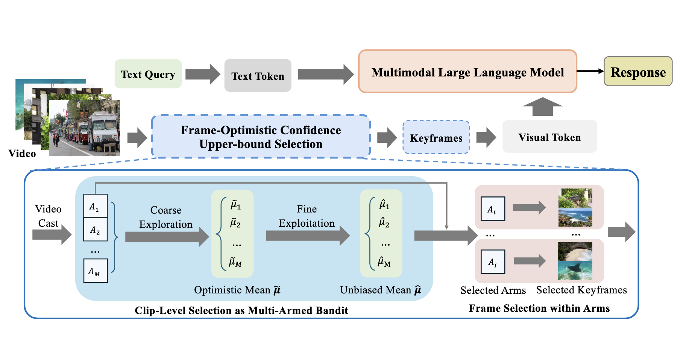

# FOCUS: Frame-Optimistic Confidence Upper-bound Selection



Multimodal large language models (MLLMs) represent images and video frames as visual tokens. Scaling from single images to hour-long videos, however, inflates the token budget far beyond practical limits. Popular pipelines therefore either uniformly subsample or apply keyframe selection with retrieval-style scoring using smaller vision-language models. However, these keyframe selection methods still rely on pre-filtering before selection to reduce the inference cost and can miss the most informative moments.

We propose **FOCUS**, *Frame-Optimistic Confidence Upper-bound Selection*, a training-free, model-agnostic keyframe selection module that selects query-relevant frames under a strict token budget. FOCUS formulates keyframe selection as a combinatorial pure-exploration (CPE) problem in multi-armed bandits: it treats short temporal clips as arms, and uses empirical means and Bernstein confidence radius to identify informative regions while preserving exploration of uncertain areas. The resulting two-stage exploration-exploitation procedure reduces from a sequential policy with theoretical guarantees, first identifying high-value temporal regions, then selecting top-scoring frames within each region.

On two long-video question-answering benchmarks, FOCUS delivers substantial accuracy improvements while processing less than 2% of video frames. For videos longer than 20 minutes, it achieves an 11.9% gain in accuracy on LongVideoBench, demonstrating its effectiveness as a keyframe selection method and providing a simple and general solution for scalable long-video understanding with MLLMs.


## Installation

1. First, follow the installation instructions from the [AKS repository](https://github.com/ncTimTang/AKS) to set up the environment and dependencies.

2. Then install the additional requirements:
```bash
pip install -r requirements.txt
```

## Usage

Run FOCUS keyframe extraction on LongVideoBench:

```bash
python select_keyframe.py \
    --dataset_name longvideobench \
    --dataset_path ./datasets/longvideobench \
    --output_dir focus_blip \
    --num_keyframes 64 \
    --batch_size 32 \
    --blip_model large
```

## Evaluation

For evaluation, please follow the evaluation setup from the [lmms-eval repository](https://github.com/EvolvingLMMs-Lab/lmms-eval) and use the evaluation scripts provided in the [AKS repository](https://github.com/ncTimTang/AKS).

## Output

FOCUS generates the following outputs:

- `selected_frames.json`: Selected keyframe indices for each video
- `sampling_details.json`: Detailed sampling information including:
  - Coarse and fine sampling results
  - Arm information and FOCUS scores
  - Arm selection probabilities
  - Video metadata
- `extraction_stats.json`: Statistics about the extraction process


## Acknowledgments

This work builds upon the excellent research from:
- [AKS: Adaptive Keyframe Sampling](https://github.com/ncTimTang/AKS) for the evaluation framework
- [lmms-eval](https://github.com/EvolvingLMMs-Lab/lmms-eval) for multimodal evaluation

